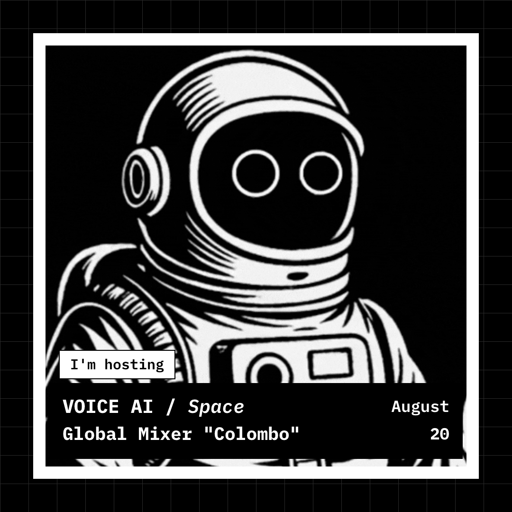

# VAS Badge Generator

A fully client-side (Vite + React) badge generator for the **Voice AI Space**
community. Upload a selfie, pick your role and event, and export a collectible
1080×1080 PNG event badge — black-and-white, early-2000s pixel aesthetic.

**🔗 Live site:** https://voice-ai-space.github.io/vas-badge-creator/

No server, no backend, no API keys. Everything — image dithering, ASCII/bitmap
rendering, captions, and PNG export — runs in the browser.

<p align="center">
  
</p>

## Features

- **Four badge roles** — `I'm hosting`, `I'm speaking at`, `We're sponsoring`,
  `I'm attending`.
- **Four portrait render modes** — Base photo, Pixel portrait, ASCII, and Bitmap,
  each with its own dithering.
- **Live controls** — pixel size, contrast, dither mode, zoom, and drag-to-pan
  framing, plus grayscale and ASCII scale.
- **Event details** — preset event types (Global Mixer, Meetup, Hackathon,
  Workshop), title, and date.
- **Ready-to-post captions** — per-platform copy (LinkedIn, X, Instagram) tuned
  to the role and event type, generated offline.
- **One-click export** — a crisp 1080×1080 PNG, sized for social.

## Local development

```bash
npm install
npm run dev        # http://localhost:5173
npm run build      # static output in dist/
npm run preview    # serve the built dist/
npm run typecheck  # tsc --noEmit
```

## Deployment

The site auto-deploys to **GitHub Pages** on every push to `main` via
[`.github/workflows/deploy.yml`](.github/workflows/deploy.yml) — it builds with
Vite and publishes `dist/` using GitHub Actions. No manual steps.

If you fork or rename the repo, no config change is needed: `vite.config.ts` uses
`base: "./"` (relative asset paths), so the build works under any
`https://<user>.github.io/<repo>/` subpath as well as a root user/org site.

## Project structure

```
src/
├── App.tsx           # generator UI — canvas badge, controls, captions
├── main.tsx          # React entry point
├── styles.css        # Tailwind v4 styles
└── lib/
    ├── dither.ts     # pixel / bitmap / ASCII renderers + cover-crop & pan math
    └── captions.ts   # per-platform, per-event-type caption templates
```

## Tech stack

React 19 · TypeScript · Vite 8 · Tailwind CSS v4 · [sonner](https://sonner.emilkowal.ski/) toasts.

This is a standalone static build of the original TanStack Start (SSR) app; the
client-side pipeline is identical, just without the server.
